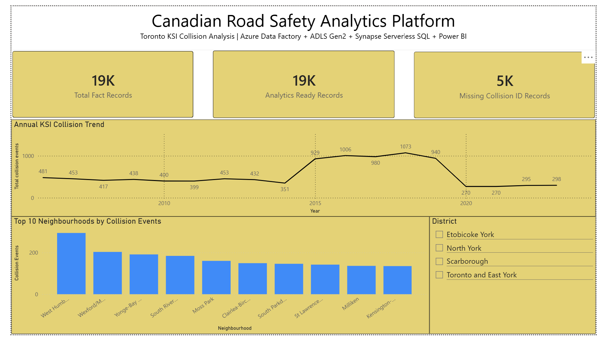

# Canadian Road Safety Analytics Platform on Azure

## Overview

The **Canadian Road Safety Analytics Platform** is an end-to-end Azure Data Engineering project that ingests public Toronto KSI collision data, stores it in **Azure Data Lake Storage Gen2**, transforms and validates it using **Azure Synapse Serverless SQL**, and visualizes business-ready insights in **Power BI**.

The project demonstrates a production-style data workflow with:

- Azure Data Factory ingestion
- ADLS Gen2 lakehouse zones
- Synapse Serverless SQL transformations
- SQL-based data quality checks
- Curated reporting views
- Power BI dashboard

---

## Business Problem

Road safety teams need reliable analytics to identify serious collision trends, high-risk locations, and data quality issues that could affect public safety reporting.

This project answers:

- Which years had the highest KSI collision activity?
- Which districts and neighbourhoods had the most collision events?
- Which road, lighting, visibility, and traffic control conditions appeared most often?
- Is the final reporting data complete, valid, and analytics-ready?

---

## Dataset

| Item | Details |
| --- | --- |
| Source | Toronto Police Service Public Safety Data Portal |
| Dataset | Killed and Seriously Injured Collision Data |
| Coverage | 2006–2023 |
| Format | CSV |
| Raw Records | 18,957 |

---

## Architecture

```text
Toronto Police Service KSI CSV
        ↓
Azure Data Factory
        ↓
ADLS Gen2 Raw Zone
        ↓
Synapse Serverless SQL Raw View
        ↓
Cleaned View + Data Quality Flags
        ↓
Curated Fact and Dimension Views
        ↓
Business Reporting Views
        ↓
Power BI Dashboard
```

---

## Azure Services Used

| Service | Purpose |
|---|---|
| Azure Data Factory | Ingested public CSV data |
| ADLS Gen2 | Stored raw, cleaned, curated, metadata, logs, archive, and DQ zones |
| Synapse Serverless SQL | Queried, cleaned, modeled, and validated lake data |
| Power BI Desktop | Built final dashboard |
| Azure RBAC / Managed Identity | Secured ADF and Synapse access to ADLS |
| Azure Cost Management | Monitored free-trial usage and cost risk |

---

## Data Lake Structure

```text
roadsafety/
├── raw/
│   └── collisions/
├── cleaned/
│   └── collisions/
├── curated/
│   ├── fact_collision_events/
│   ├── dim_date/
│   ├── dim_location/
│   ├── dim_road_condition/
│   └── dim_collision_factor/
├── dq/
├── metadata/
├── logs/
└── archive/
```

---

## Pipeline Flow

### 1. Ingestion

Azure Data Factory copied the public KSI CSV into ADLS Gen2:

```text
roadsafety/raw/collisions/ksi_collisions_2006_2023_raw.csv
```

Pipeline:

```text
pl_ingest_ksi_collision_raw
```

---

### 2. Raw Layer

Synapse Serverless SQL reads the raw CSV through:

```sql
dbo.vw_raw_ksi_collisions
```

Raw record count:

```text
18,957
```

---

### 3. Cleaned Layer

The cleaned view standardizes columns, safely converts data types, derives date/time fields, and adds data quality flags.

```sql
dbo.vw_cleaned_ksi_collisions
```

Key checks include:

- Missing collision IDs
- Invalid dates
- Invalid coordinates
- Safe type conversion using `TRY_CAST` and `TRY_CONVERT`

---

### 4. Curated Layer

Curated fact and dimension views were created for analytics:

```sql
dbo.vw_fact_collision_events
dbo.vw_dim_date
dbo.vw_dim_location
dbo.vw_dim_road_condition
dbo.vw_dim_collision_factor
```

Because `ACCNUM` had null values, the model uses:

- `OBJECTID` as the technical traceability key
- `ACCNUM` when available
- Fallback `collision_event_key` for reporting

---

### 5. Reporting Layer

Business reporting views were created for Power BI:

```sql
dbo.vw_rpt_annual_collision_trend
dbo.vw_rpt_location_risk_summary
dbo.vw_rpt_road_condition_summary
dbo.vw_rpt_data_quality_summary
```

---

## Data Quality Results

| Validation Check | Result |
|---|---:|
| Raw record count | 18,957 |
| Cleaned record count | 18,957 |
| Curated fact record count | 18,957 |
| Raw-to-cleaned difference | 0 |
| Cleaned-to-curated difference | 0 |
| Date range | 2006-01-01 to 2023-12-29 |
| Invalid dates | 0 |
| Invalid coordinates | 0 |
| Missing `ACCNUM` records | 4,930 |
| Record loss | 0 |

---

## Power BI Dashboard

The dashboard shows:

- Total KSI records
- Analytics-ready records
- Missing collision ID records
- Annual KSI collision trend
- Top 10 neighbourhoods by collision events
- District slicer



---

## Repository Structure

```text
azure-road-safety-analytics-platform/
├── adf/
├── powerbi/
├── screenshots/
├── sql/
└── README.md
```

---

## Technical Skills Demonstrated

- Azure Data Factory
- Azure Data Lake Storage Gen2
- Synapse Serverless SQL
- Power BI Desktop
- SQL transformations
- Data quality validation
- Raw-to-curated reconciliation
- Fact and dimension modeling
- Managed identity and RBAC
- Cost-control documentation
- Troubleshooting and root-cause analysis

---

## QA to Data Engineering Relevance

This project applies QA/SDET thinking to Data Engineering by using:

- SQL validation rules
- Record-count reconciliation
- Schema inspection
- Data profiling
- Defect analysis
- Root-cause troubleshooting
- Data quality flags
- UAT-style dashboard validation

The project validates each stage before exposing data to reporting.

---

## Final Outcome

The project successfully processed **18,957 public KSI collision records** from ingestion to dashboard with **zero record loss** across raw, cleaned, and curated layers.

```text
Raw:      18,957
Cleaned:  18,957
Curated:  18,957
Record loss: 0
```

---

